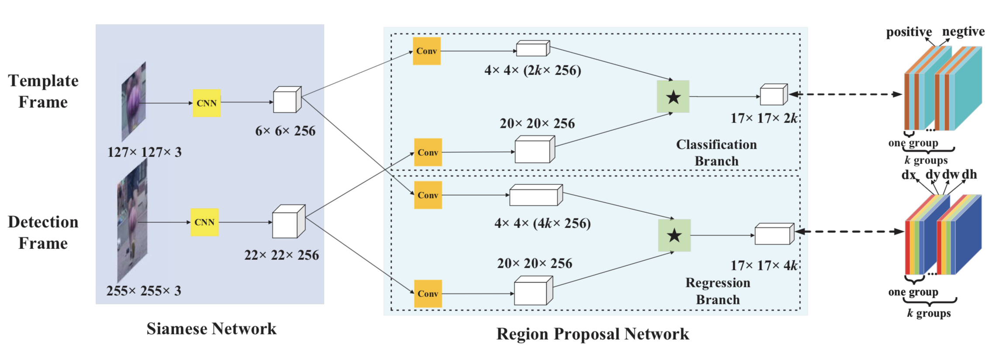
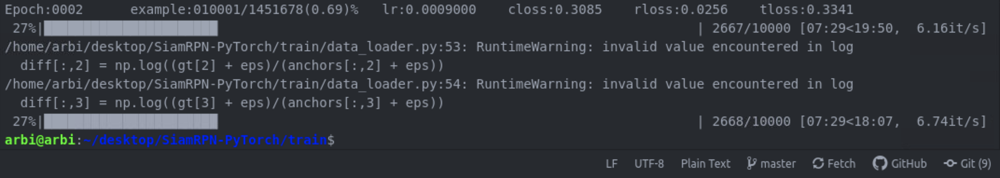
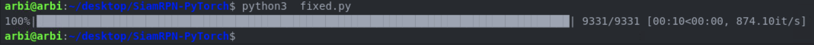
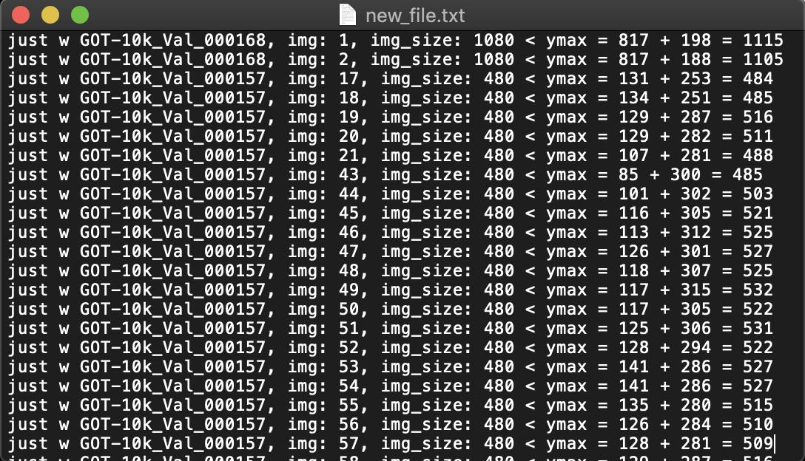

# SiamRPN-PyTorch
Copy from https://github.com/researchmm/SiamDW

Implementation SiamRPN on PyTorch with GOT-10k dataset  

High Performance Visual Tracking With Siamese Region Proposal Network 2018_CVPR


<center>
    <figure>
        
        <figcaption>
        </figcaption>
    </figure>
</center>

## How to run Training
1. Download the GOT-10k dataset in http://got-10k.aitestunion.com/downloads
2. Run the train_siamrpn.py script:
```
cd train

python3 train_siamrpn.py --train_path=/path/to/dataset/GOT-10k/train
```

## pip install
```
pip3 install shapely
```

## How to fix GOT-10k dataset

<center>
    <figure>
        
        <figcaption>
        </figcaption>
    </figure>
</center>

1. First you need to delete four videos:
```
GOT-10k_Train_008628
GOT-10k_Train_008630
GOT-10k_Train_009058  
GOT-10k_Train_009059
```
Because they are ymin and xmin is greater than the size of the image.

2. Run the fixed.py script:
```
python3 fixed.py --dataset_path=/path/to/dataset/GOT-10k/train
```
<center>
    <figure>
        
        <figcaption>
        </figcaption>
    </figure>
</center>

After you have new_file.txt file. In this file a lot of information about where the error.

<center>
    <figure>
        
        <figcaption>
        </figcaption>
    </figure>
</center>

You do not need to change anything yourself, the fixed.py script will do it for you.

## How to test
### SiamFC
```bash
cd ~/siamdw
python siamese_tracking/test_siamfc.py --arch SiamFCRes22 --resume /home/syh/siamdw/snapshot/CIResNet22.pth --dataset VOT2016 
python siamese_tracking/test_siamfc.py --arch SiamFCRes22 --resume /home/syh/siamdw/snapshot/CIResNet22.pth --dataset OTB2013 
```

### SiamRPN
```bash
cd ~/siamdw
python siamese_tracking/test_siamrpn.py --arch SiamRPNRes22 --resume /home/syh/siamdw/snapshot/CIResNet22_RPN.pth --dataset VOT2016 
python siamese_tracking/test_siamrpn.py --arch SiamRPNRes22 --resume /home/syh/siamdw/snapshot/CIResNet22_RPN.pth --dataset OTB2013 
```

已经执行过预测，代码会直接跳过，不再执行测试.
调试的时候要注意了，删除掉 /home/syh/siamdw/result


## Authors

* `Bo Li` - paper - [Siamese-RPN](http://openaccess.thecvf.com/content_cvpr_2018/papers/Li_High_Performance_Visual_CVPR_2018_paper.pdf)
* `De jiasong` - code - [Siamese-RPN-pytorch](https://github.com/songdejia/Siamese-RPN-pytorch)
* `Makalo` - code - [Siamese-RPN-tensorflow](https://github.com/makalo/Siamese-RPN-tensorflow)
